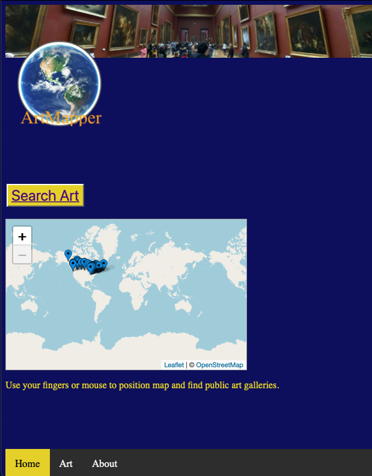
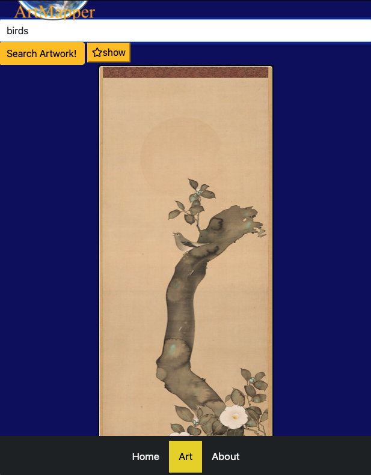

# Assignment07

This is the repo for Team Delta - Project One due February 8, 2021.

# Unit 07 Project 01: Project One

Submitted: February 8, 2021
            Jack Murphy, Lead Art API Developer
            Benoit Lacroque, Lead Map API and Geolocation Developer
            Ricardo Diaz, Project Management, Testing
            Daniel Digiorgio, Lead, Agile Testing, 647 680-9069
            Michael O'Connor, WebDev Wannabe, Testing, Project Management and Documentation, 604 765-6061

# 01 Goal: Here is a link to the Github folder https://github.com/Richo1213/project-1 and a link to the deployed website  https://richo1213.github.io/project-1/index.html.

# 02 Approach:

    In approching this project, our team met to discuss various options for a Minimum Viable product.  After discussion and basic reasearch on various APIs, we landed on an Art App that would allow various art websites to be accessed for isolated covid travellers, we have prototyped the app using the HArvard Art Galleries API, We agreed that we would use local storage to save favourites and we decided that we would alo add a map API to present galleries nearby the USER or searchable, by scrolling to various cities to see active links to public galleries in Canada.

    We understood that there were certain immutable user requirements: 
            
            [X] To use a CSS framework other than Bootstrap.

            [X] To be deployed to GitHub Pages.

            [X] To be interactive (i.e., accept and respond to user input).

            [X] To use at least two server-side APIs.

            [X] That does not use alerts, confirms, or prompts (use modals).

            [X] That uses client-side storage to store persistent data.

            [X] The app should be responsive.

            [X] The app should have a polished UI.

            [x] The app should have a clean repository that meets quality coding standards (file structure, naming conventions, follows best practices for class/id naming conventions, indentation, quality comments, etc.).

            [x] There should be a quality README (with unique name, description, technologies used, screenshot, and link to deployed application).

    We allocated the work to those who best could deliver on elements of the project and documented a roadmap for the project and they set out to build the project element as a proof of concept.  We used the KANBAN model for managing the project and met on weekends and during the class time to advance the project. SEE THE KANBAN https://github.com/Richo1213/project-1/projects/1 to follow the flow of the work effort. At all times we had the scope limitations and timelines in mind to ensire success.  On the Friday before delivery, we had the final working prototype that would undergo user acceptance testing over the weekend.  We tried to work on branches, but sometimes, veered away from that using good communication among members.

## Presentation Requirements

The presentation on Monday February 8, 2021 should address the following: 

            [x] Elevator pitch: a one minute description of your application

            [x] Concept: What is your user story? What was your motivation for development?

            [x] Process: What were the technologies used? How were tasks and roles broken down and assigned? What challenges did you encounter? What were your successes?

            [x] Demo: Show your stuff!

            [x] Directions for Future Development

            [x] Links to the deployed application and the GitHub repository

# 03 Testing and Quality Control:

    Testing included (see Testing Routine ):

        [x] Agile Component Testing - MAP API, first by developer and then by independent team member;
        [x] Agile Component Testing - ART API, first by developer and then by independent team member;
        [x] Integrated Testing, down by all team members on the fly as integration was underway, then on weekend;
        [x] Regression testing of key functionality once final changes made;
        [x] User Acceptance testing.

# 04 Lessons Learned:

The following items should be considered for future enhancements, time and budget permitting:

    1. How to get an API key and extract data from art and map sites.

    2. Hww top work with localStorage.

    3. Styling and integration various files.

# 05 Further improvements to make:

    1. Add more APIs.

    2. Add more fields to search on.

    3. Cross API search capabilities.

    4. Ability to send links to specific works of art.

    5. More responsive map container.
    
    6. Add social media links.

# 06 Current Renderings:

